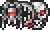

<!DOCTYPE html>
<html lang="en">

	<head>
		<meta charset="utf-8">
		<meta name="viewport" content="width=device-width, initial-scale=1">
		
		<title>Terraria Assistant</title>
		
		<link id="page-style" rel="stylesheet" href="stylesheets/dark.css" type="text/css">
		<link rel="shortcut icon" href="images/assistant/favicon.ico">
		
		
		<link href="https://fonts.googleapis.com/css?family=Rubik:400,500&display=swap" rel="stylesheet">
		
		
		
		
		
		
		
	</head>
	
	<body id="body" onload="chosenTheme()">
		

			

				
				<a href="index.html">Terraria Assistant</a>
			

			

				<a href="index.html">Home</a>
				<a href="https://forums.terraria.org/index.php?forums/released.125/" target="_blank">Texture Packs</a>
			

			

				<input type="image" src="images/assistant/toggle%20theme.png" height="18" width="18" onclick="toggleTheme()">
				
				<input type="image" src="images/assistant/license.png" height="18" width="18" onclick="showLicense()">
				
			

		

		
		

		
			

				

					
World Options

					

						

							
World&nbsp;Evil

							<input type="radio" id="evil-corruption" name="evil" value="corruption" autocomplete="off">
							<label for="evil-corruption"></label>
							<input type="radio" id="evil-crimson" name="evil" value="crimson" autocomplete="off">
							<label for="evil-crimson"></label>
						

						

							
Difficulty

							<input type="radio" id="difficulty-normal" name="difficulty" value="normal" autocomplete="off">
							<label for="difficulty-normal"></label>
							<input type="radio" id="difficulty-expert" name="difficulty" value="expert" autocomplete="off">
							<label for="difficulty-expert"></label>
						

					

				

			
				

					

						
Classes

						<input type="radio" id="content-crimson-knight" name="content" value="crimson-knight" autocomplete="off">
						<label for="content-crimson-knight"></label>
						<input type="radio" id="content-healer" name="content" value="healer" autocomplete="off">
						<label for="content-healer"></label>
						<input type="radio" id="content-magic" name="content" value="magic" autocomplete="off">
						<label for="content-magic"></label>
						<input type="radio" id="content-melee" name="content" value="melee" autocomplete="off">
						<label for="content-melee"></label>
						<input type="radio" id="content-ranged" name="content" value="ranged" autocomplete="off">
						<label for="content-ranged"></label>
						<input type="radio" id="content-summoning" name="content" value="summoning" autocomplete="off">
						<label for="content-summoning"></label>
						<input type="radio" id="content-throwing" name="content" value="throwing" autocomplete="off">
						<label for="content-throwing"></label>
						<input type="radio" id="content-yo-yo" name="content" value="yo-yo" autocomplete="off">
						<label for="content-yo-yo"></label>
						<input type="radio" id="content-mixed" name="content" value="mixed" autocomplete="off">
						<label for="content-mixed"></label>
						
Content

						<input type="radio" id="content-bosses" name="content" value="bosses" autocomplete="off">
						<label for="content-bosses"></label>
						<input type="radio" id="content-fish" name="content" value="fish" autocomplete="off">
						<label for="content-fish"></label>
						<input type="radio" id="content-potions" name="content" value="potions" autocomplete="off">
						<label for="content-potions"></label>
						<input type="radio" id="content-vanity" name="content" value="vanity" autocomplete="off">
						<label for="content-vanity"></label>
					

				

					
				

					

						
Upcoming Boss

						<input type="radio" id="progress-pre-bosses" name="progress" value="pre-bosses" autocomplete="off">
						<label for="progress-pre-bosses"></label>
						<input type="radio" id="progress-pre-skeletron" name="progress" value="pre-skeletron" autocomplete="off">
						<label for="progress-pre-skeletron"></label>
						<input type="radio" id="progress-pre-hardmode" name="progress" value="pre-hardmode" autocomplete="off">
						<label for="progress-pre-hardmode"></label>
						<input type="radio" id="progress-pre-mechanical" name="progress" value="pre-mechanical" autocomplete="off">
						<label for="progress-pre-mechanical"></label>
						<input type="radio" id="progress-pre-plantera" name="progress" value="pre-plantera" autocomplete="off">
						<label for="progress-pre-plantera"></label>
						<input type="radio" id="progress-pre-lunar" name="progress" value="pre-lunar" autocomplete="off">
						<label for="progress-pre-lunar"></label>
						<input type="radio" id="progress-pre-moon-lord" name="progress" value="pre-moon-lord" autocomplete="off">
						<label for="progress-pre-moon-lord"></label>
						<input type="radio" id="progress-endgame" name="progress" value="endgame" autocomplete="off">
						<label for="progress-endgame"></label>
					

				

				
				

			

			
			

				

				

			

		

		
		

			

				

					&times;
					Licensing Information
				

				

					
All <a href="https://terraria.org/" target="_blank">Terraria</a> related images and information presented on this website are available from the <a href="https://terraria.gamepedia.com/Terraria_Wiki" target="_blank">Terraria Wiki</a> under the <a href="https://creativecommons.org/licenses/by-nc-sa/3.0/" target="_blank">CC BY-NC-SA 3.0 license</a> unless otherwise noted.

					
The <a href="https://icons8.com/icon/16711/creative-commons">Creative Commons icon</a> on the navigation bar is available from <a href="https://icons8.com/" target="_blank">Icons8</a> under the <a href="https://creativecommons.org/licenses/by-nd/3.0/" target="_blank">CC BY-ND 3.0 license</a>.

					
<a href="index.html" target="_blank">Terraria Assistant</a> is available under the <a href="https://choosealicense.com/licenses/mit/" target="_blank">MIT license</a>. The source is available <a href="https://github.com/Marotheit/Terraria-Assistant">here</a>.

					
Game content and materials are trademarks and copyrights of their respective publisher and its licensors.

				

				

					If you find images or information presented on this website that violates the licenses listed above, please contact the domain administrator <a href="mailto:Terraria.Assistant@gmail.com">here</a>.
				

			

		

		
		

	</body>

</html>
